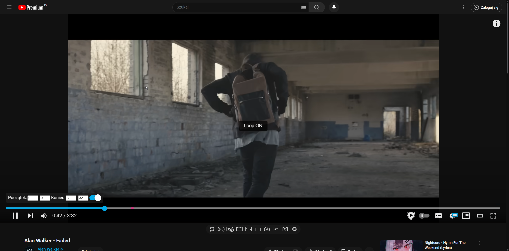

# 🎬 Enhancer for YouTube – Auto Loop + Next Video Shortcuts (with User Override)

A custom script for **Enhancer for YouTube™** that enhances the YouTube player with:

- Automatic **loop enabling** when a new video starts  
- Manual loop toggle using the **R** key  
- Skip to next video using the **N** key  
- Smart **user override memory** — if you disable loop manually, the script will not auto‑enable it on the next videos  
- Clean **Loop ON/OFF** and **Next Video** toast notifications with smooth fade‑in/fade‑out animation  

---

## ✨ Features

### 🔁 Auto Loop  
Automatically enables loop **once per new video**, unless the user manually disabled it.

### 🧠 User Override Memory  
If you turn loop **OFF** using the **R** key, the script remembers your choice and **keeps loop OFF** on all following videos until you enable it again.

### ⌨️ Keyboard Shortcuts  
| Key | Action |
|-----|--------|
| **R** | Toggle loop ON/OFF |
| **N** | Skip to next video |

### 🪄 Toast Notifications  
- Centered overlay  
- Smooth fade‑in / fade‑out  
- Shows: **Loop ON**, **Loop OFF**, **Next Video**

---

## 🛠 Installation

1. Install **[Enhancer for YouTube™](https://www.mrfdev.com/enhancer-for-youtube)** in your browser.  
2. Open **Enhancer for YouTube settings**.  
3. Go to the **Custom JavaScript** section.  
4. Paste the contents of [`v1.js`](./v1.js) into the script field.  
5. Enable:  
   - **“Automatically execute the script when YouTube loads into the tab”**  
6. Save changes and refresh YouTube.

---

## 💡 Notes

- Works only with **Enhancer for YouTube™** installed.  
- Auto Loop triggers **only once per new video**.  
- If you disable loop manually, auto‑loop will **not** re‑enable it until you turn it back on.  
- The **N** shortcut works only when YouTube’s “Next” button is available.  
- Fully compatible with YouTube’s SPA navigation (no page reload needed).

---

## 📜 License

This project is licensed under the **MIT License**.  
See the [LICENSE](LICENSE) file for details.

---

## 📷 Preview

---

**Author:** [CYNOXREAL](https://github.com/CYNOXREAL)  
**Year:** 2025
